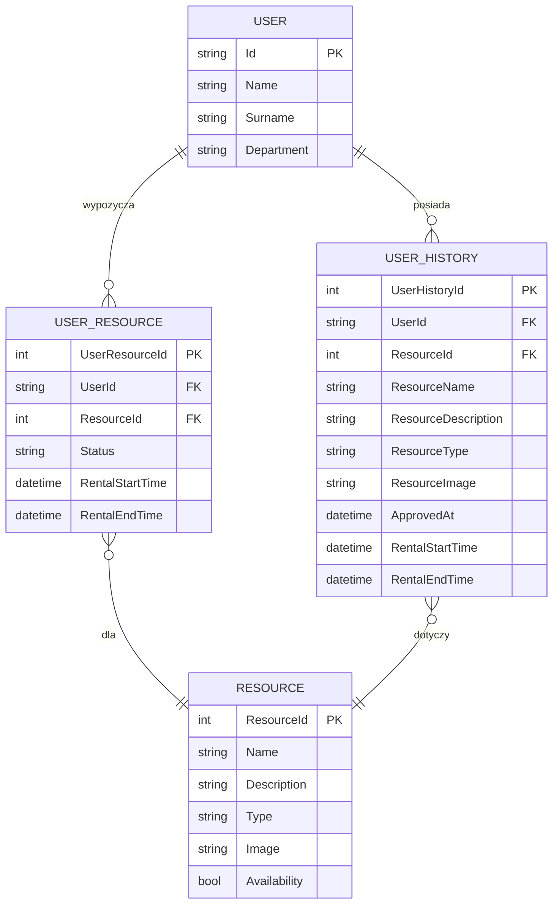
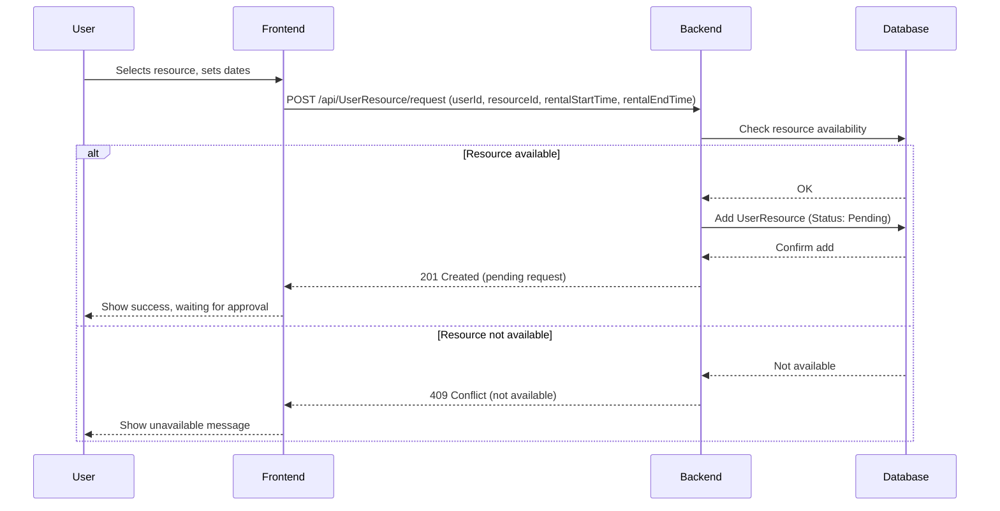
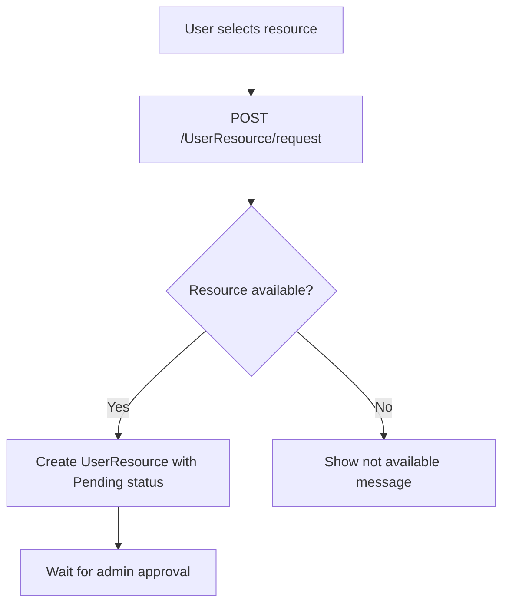
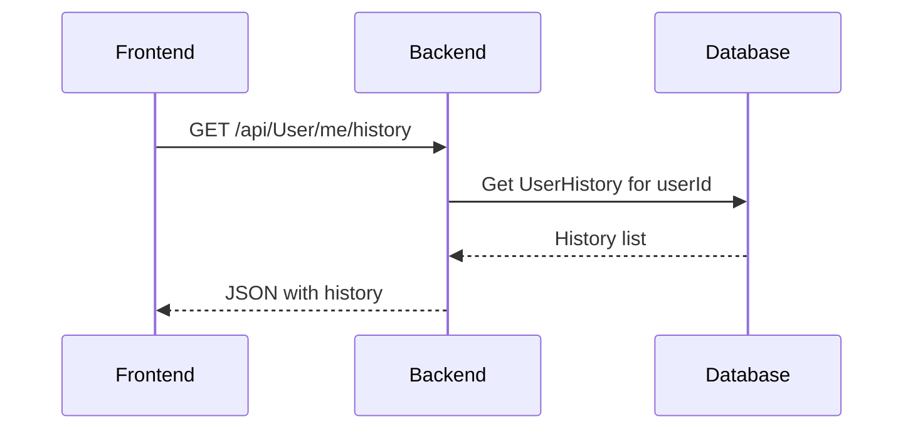

# Reserve App Backend

Backend (.NET/C#) aplikacji do rezerwacji zasobow. Udostepnia API do obslugi uzytkownikow, zasobow, rezerwacji oraz historii wypozyczen (UserHistory).

## Spis tresci
- [Opis projektu](#opis-projektu)
- [Diagramy](#diagramy)
- [Wymagania funkcjonalne](#wymagania-funkcjonalne)
- [Wymagania niefunkcjonalne](#wymagania-niefunkcjonalne)
- [Wymagania systemowe](#wymagania-systemowe)
- [Instalacja](#instalacja)
- [Uruchomienie](#uruchomienie)
- [Struktura projektu](#struktura-projektu)
- [Glowne funkcje](#glowne-funkcje)
- [Przykladowe scenariusze uzycia](#przykladowe-scenariusze-uzycia)
- [Wspoltworzenie](#wspoltworzenie)
- [Licencja](#licencja)
- [Kontakt](#kontakt)

---

## Opis projektu

REST API zapewniajace zarzadzanie uzytkownikami, zasobami, rezerwacjami oraz historia wypozyczen (UserHistory). Pozwala uzytkownikom na sledzenie historii wszystkich wypozyczen, a administratorowi na przeglad dzialan uzytkownikow.

---

## Diagramy

### Struktura bazy danych (fragment)



### Sequence diagram – Resource Request



### Flowchart – Resource Request



### Use Case diagram – Resource Request

```mermaid
usecaseDiagram
    actor User
    actor Admin

    User --> (Request resource)
    Admin --> (Approve or reject request)
    User --> (Receive request status notification)
```

### Sequence diagram – User History



---

## Wymagania funkcjonalne

1. **Obsluga uzytkownikow:**
   - Rejestracja, logowanie, edycja danych, zarzadzanie rolami.
2. **Zarzadzanie zasobami:**
   - Dodawanie, edycja, usuwanie zasobow.
3. **System rezerwacji:**
   - Tworzenie, zatwierdzanie, anulowanie rezerwacji.
4. **Historia wypozyczen (UserHistory):**
   - Tworzenie rekordu historii przy zatwierdzeniu wypozyczenia.
   - Endpoint GET /api/User/me/history zwracajacy liste historii uzytkownika.
   - Dane: nazwa zasobu, opis, typ, obraz, daty wypozyczenia.
5. **Panel admina:**
   - Przeglad historii wypozyczen uzytkownikow
   - Zarzadzanie uzytkownikami i zasobami.
6. **Powiadomienia e-mail**

---

## Wymagania niefunkcjonalne

- Wydajnosc: odpowiedz <1s dla 95% zadan
- Bezpieczenstwo: JWT, hash + salt, ochrona przed SQLi/XSS/CSRF
- Skalowalnosc: rozdzielenie warstw, wsparcie dla chmury
- Backupy bazy, monitoring bledow
- Testy jednostkowe i integracyjne

---

## Wymagania systemowe

- .NET 6+
- SQL Server lub PostgreSQL
- Entity Framework

---

## Instalacja

```sh
git clone https://github.com/Re1ncarnat10/ReserveApp.git
cd ReserveApp
dotnet restore
```

---

## Uruchomienie

```sh
dotnet run
```
API na http://localhost:5000

---

## Struktura projektu

- `Controllers/UserController.cs` – endpointy uzytkownika (w tym historia)
- `Models/UserHistory.cs` – model historii wypozyczen
- `Dtos/UserHistoryDto.cs` – DTO historii wypozyczen
- `Services/UserService.cs` – logika pobierania historii uzytkownika
- `Data/AppDbContext.cs` – konfiguracja encji UserHistory

---

## Glowne funkcje

- Rejestracja, logowanie, obsluga JWT
- Zarzadzanie zasobami i uzytkownikami
- Rezerwacje
- Historia wypozyczen (UserHistory)
- Powiadomienia e-mail
- Audyt operacji

---

## Przykladowe scenariusze uzycia

- Uzytkownik loguje sie i sprawdza historie wypozyczen.
- Uzytkownik requestuje zasob – oczekuje na akceptacje lub odrzucenie.
- Administrator przeglada historie wszystkich uzytkownikow.

---

## Wspoltworzenie

1. Fork repozytorium
2. Nowa galaz (`feature/nazwa`)
3. Zmiany + testy
4. Pull Request

---

## Licencja

MIT

---

## Kontakt

Masz pytania? Issues lub [Twoj_email@example.com]
